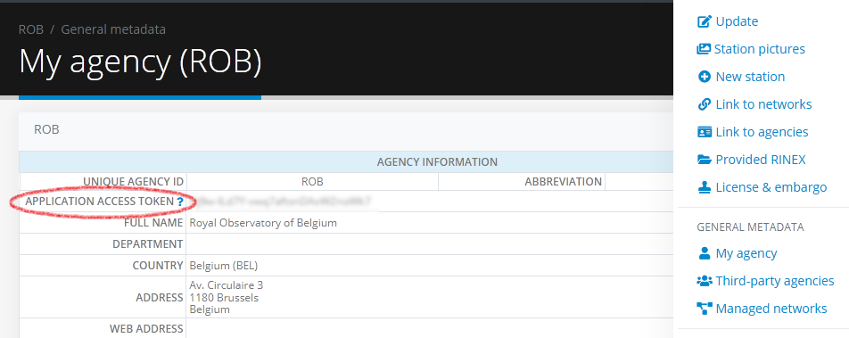

# Upload info to M<sup>3</sup>G

In the Bash shell, one could use a command-line such *curl* to access M<sup>3</sup>G API: it acts as an HTTP client and allows you to send requests and display/store the corresponding responses.

Let's look at a quick test example on how to update/change the firmware section of station (given its 9-character id). Indeed, if one has a look at the [M<sup>3</sup>G API documentation](https://gnss-metadata.eu/__test/site/api-docs#/Update/put_sitelog_firmware_change), the required argument are the `id` aka the station 9-characters id and the records that will be changed as key/values pairs: the name of the person who is allowed to change the site log (`updateMadeBy`), the new firmware version (`changedTo`) and the date.

To do this, one needs choose a station belonging to his/her agency and first get authorized. You need the "*Application access token*": you can find it in "*My agency*" once logged in in M<sup>3</sup>G, see the figure below:



Let's pick the station BRUX00BEL and let's say I'd like to change the version of its firmware to '5.3.1'.

One would need to pass some data, in json format e.g. stored in the file `firmware.json`:

```JSON
{
    "updateMadeBy": "Carine Bruyninx",
    "endOfTheLastSection": "2020-09-30T09:35Z",
    "changedTo": "5.3.1",
    "startOfTheNewSection": "2020-09-30T09:36Z"
}
```
where the name of the person appearing as `updateMadeBy` must correspond to one of the contacts already set up in the *My agency* page in M<sup>3</sup>G (see figure above).

Then, via *curl*:

```bash
curl -i -X PUT "https://gnss-metadata.eu/__test/v1/sitelog/firmware-change?id=BRUX00BEL" -H  "accept: application/json" -H  "Authorization: Bearer xxx.." -H  "Content-Type: application/json" -d @firmware.json
```
where `xxx..` is your "*Application access token*". The option `-i` will allow you to get back some useful information about your HTTP request, including HTTP response status code ([defined by HTTP standards](https://restfulapi.net/http-status-codes)) e.g. `200` for a successful request:
```
HTTP/1.1 200 OK
Date: Wed, 30 Sep 2020 09:39:55 GMT
Server: Apache/2.4.6 (CentOS) OpenSSL/1.0.2k-fips
Vary: Accept
Set-Cookie: _csrf=8fcbeb32215f670ee60463f6276a160c385a199d5e096863abc43c8bb5e8d782a%3A2%3A%7Bi%3A0%3Bs%3A5%3A%22_csrf%22%3Bi%3A1%3Bs%3A32%3A%22RsJfDHRXLUxqkdYTqnxwE9oRysUseDiE%22%3B%7D; path=/; HttpOnly
Content-Length: 590
Content-Type: application/json; charset=UTF-8

{"id":"BRUX00BEL",
"uri":"https://gnss-metadata.eu/__test/v1/sitelog/view?id=BRUX00BEL",
"md5Sitelog":"c569da06b17e8acf75e30c86c6024935",
"md5Geodesyml":"8613e46ce60c32b260b72915ffef770c",
"sitelogName":"brux00bel_20200930.log",
"geodesymlName":"BRUX00BEL.xml",
"preparedDate":"2020-09-30T00:00Z",
"dateUpdate":"2020-09-30T09:39Z",
"_links":{"self":{"href":"https://gnss-metadata.eu/__test/v1/sitelog/view?id=BRUX00BEL"},"geodesyML":{"href":"https://gnss-metadata.eu/__test/v1/sitelog/exportxml?id=BRUX00BEL"},"sitelog":{"href":"https://gnss-metadata.eu/__test/v1/sitelog/exportlog?id=BRUX00BEL"}}}
```
In the output information above, you also get the links to download the updated site log in various format e.g. https://gnss-metadata.eu/__test/v1/sitelog/exportlog?id=BRUX00BEL
